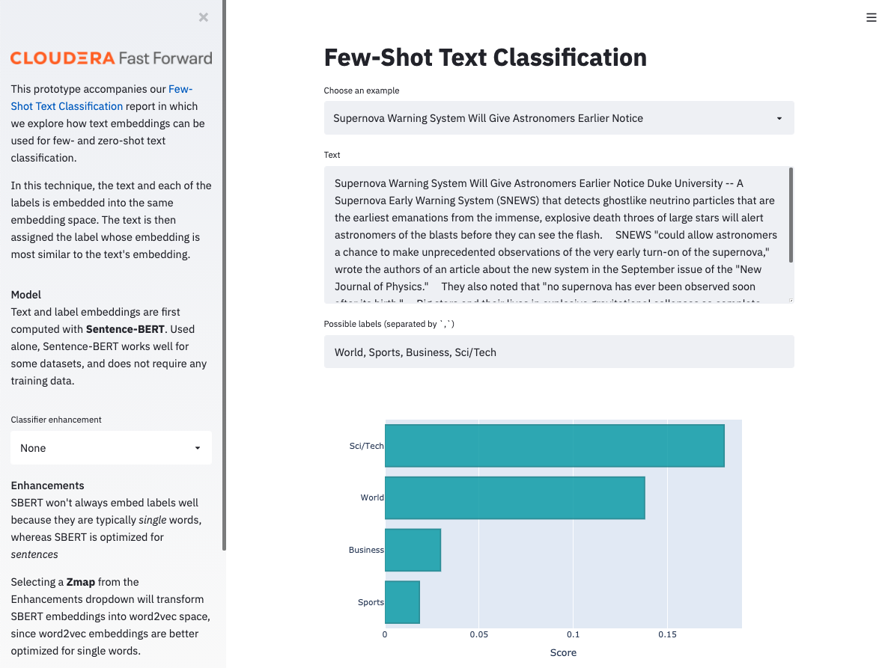

# Few-Shot Text Classification

This repo accompanies the Cloudera Fast Forward report [Few-Shot Text Classification](https://few-shot-text-classification.fastforwardlabs.com/). It provides an example application of classification using latent text embeddings with [Sentence-BERT](https://www.sbert.net/) to the AG News dataset containing thousands of news articles. 

The primary output of this repository is a small application the allows one to interact with text data and perform classification under several limited-labeled-data regimes. 



Instructions are given both for general use (on a laptop, say), and for Cloudera CML and CDSW. We'll first describe what's here, then go through how to run everything.

## Structure

```
.
├── apps        # Small Streamlit application.
├── cml         # This folder contains scripts that facilitate the project launch on CML.
├── data        # This folder contains starter data, and is where text embeddings will live.
├── scripts     # This is where all the code that does something lives.
├── notebooks   # This contains several Jupyter and Colab notebooks that accompany the report and demonstrate basic usage.
└── fewshot     # A small library of useful functions.
```

There are also `images` and  `tests` directories that are unimportant and can be ignored. Let's examine each of the important folders in turn.

### `fewshot`
```
fewshot
├── data
│   ├── loaders.py
│   └── utils.py
├── embeddings
│    ├── transformer_embeddings.py
│    └── word_embeddings.py
├── models
│    ├── few_shot.py
│    └── on_the_fly.py
├── eval.py
└── utils.py
```
The `data/loaders.py` is used in all scripts and notebooks, containing code that returns a specialized `Dataset` object that makes it easier to handle the original text, embeddings, and labels simultaneously.  

The latent text embedding method relies on first embedding text with Sentence-BERT before performing any other steps. This code is found under `embeddings/transformer_embeddings.py`. More sophisticated methods incorporate word embeddings to augment the Sentence-BERT embeddings, and this code is under `embeddings/word_embeddings.py`. 

There are two regimes in which we perform text classification and we include a model for each. `models/few_shot.py` contains code to train a model that incorporates _some_ labeled data, while `models/on_the_fly.py` computes a model that performs classification with _no labeled data at all_. 

We also provide helper functions for generating predictions and computing metrics such as basic accuracy in `eval.py`. `utils.py` contains additional helper functions for I/O and serializing data.  

### `scripts` 

```
scripts
├── few-shot_text_classification.py
├── on-the-fly_text_classification.py
```
These scripts perform basic text classification and data visualization for the various classification regimes. 

### `notebooks`
```
notebooks
├── CreatingRedditDataset.ipynb
├── Wmap_Experiments.ipynb
└── Zmap_Experiments.ipynb
```

### `apps`
The application accompanying this project comes with a launcher script to assist launching an [Application](https://docs.cloudera.com/machine-learning/cloud/applications/topics/ml-applications.html) with CDSW/CML.
To launch the applications in another environment, run the code inside the launcher file, with the prefixed `!` removed.
You may need to specify different ports.

The Few-Shot Text Classification application is a prototype user interface for the latent text embedding classification method and includes the ability to apply various models for both on-the-fly and few-shot classification on the AG News dataset. 


## Performing text classification in limited-labeled-data regimes
To go from a fresh clone of the repo to the final state, follow these instructions in order.

### Installation
The code and applications within were developed against Python 3.6.9, and are likely also to function with more recent versions of Python. We relied on GPUs for much of the analysis and use a version of PyTorch optimized for CUDA 10.2. 

To install dependencies, first create and activate a new virtual environment through your preferred means, then pip install from the requirements file. I recommend:

```python
python3 -m venv .venv
source .venv/bin/activate
pip install -r requirements.txt
```

In CML or CDSW, no virtual env is necessary. Instead, inside a Python 3 session (with at least 2 vCPU / 4 GiB Memory), simply run

```python
!pip3 install -r requirements.txt     # notice `pip3`, not `pip`
```
---
#### Note on GPUs
The `requirements.txt` file installs a GPU-compatible version of PyTorch. If GPUs are not in your future, it might be prudent to instead install a CPU-only version of torch (which is more lightweight) with the following command: 

```python
!pip3 install torch==1.6.0+cpu torchvision==0.7.0+cpu -f https://download.pytorch.org/whl/torch_stable.html
```
(For non-CML/CDSW environments, remove the `!`.)

---

Next, from inside the root directory of this repo, install the `fewshot` module with

```python
pip3 install -e .
```

### Data
We use two datasets in several of the scripts and notebooks, although the final application currently only allows interaction with the AG News dataset. 

**AG News** 

This is a collection of 127,600 news articles in four categories. The dataset is pulled from the open-source [Datasets repository](https://huggingface.co/datasets) maintained by HuggingFace. The `load_or_cache_data` function in the `data/loaders.py` file manages downloading this dataset on its first call, after which the dataset is cached and does not need to be downloaded again. 

**Reddit**

This [dataset](https://www.aclweb.org/anthology/W17-4508/) contains nearly four million preprocessed submissions and comments from Reddit, collected between 2006 and 2016. Like AG News, it is also available on the HuggingFace Datasets repository, but it is **extremely large** and we do not recommend that you download it yourself. Instead, we provide curated subsamples of this dataset in the `data/reddit` directory, as well as a notebook (`CreatingRedditDataset.ipynb`) detailing how we performed the sampling. 

### Scripts / Notebooks
To fit models and perform text classification experiments, one can either call the scripts in the `scripts` directory, or walk through a more detailed process in either the `notebooks/Zmap_Experiments.ipynb` or `notebooks/Wmap_Experiments.ipynb` notebooks. 

To run scripts, follow this procedure in the terminal:

```bash
python3 scripts/on-the-fly_text_classification.py
python3 scripts/few-shot_text_classification.py
```

These scripts will generate several models (known either as `Zmaps` or `Wmaps`), which will be saved to the `data` directory under the `maps` subdirectory. These models are used in our prototype application and we have thus included pre-learned versions already. 
